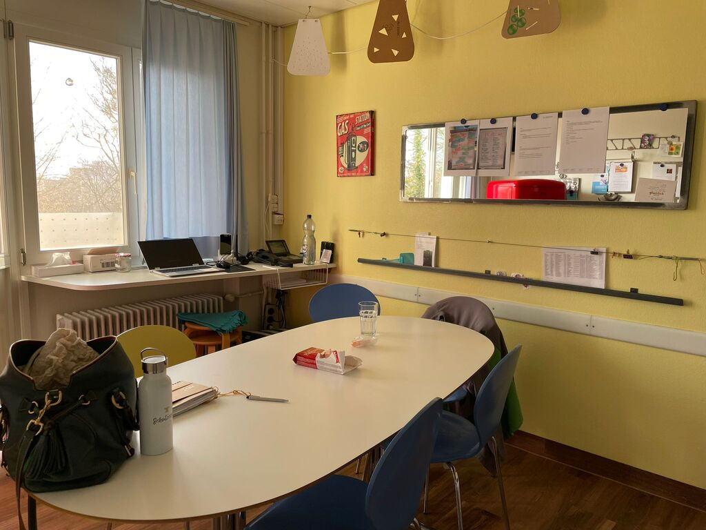
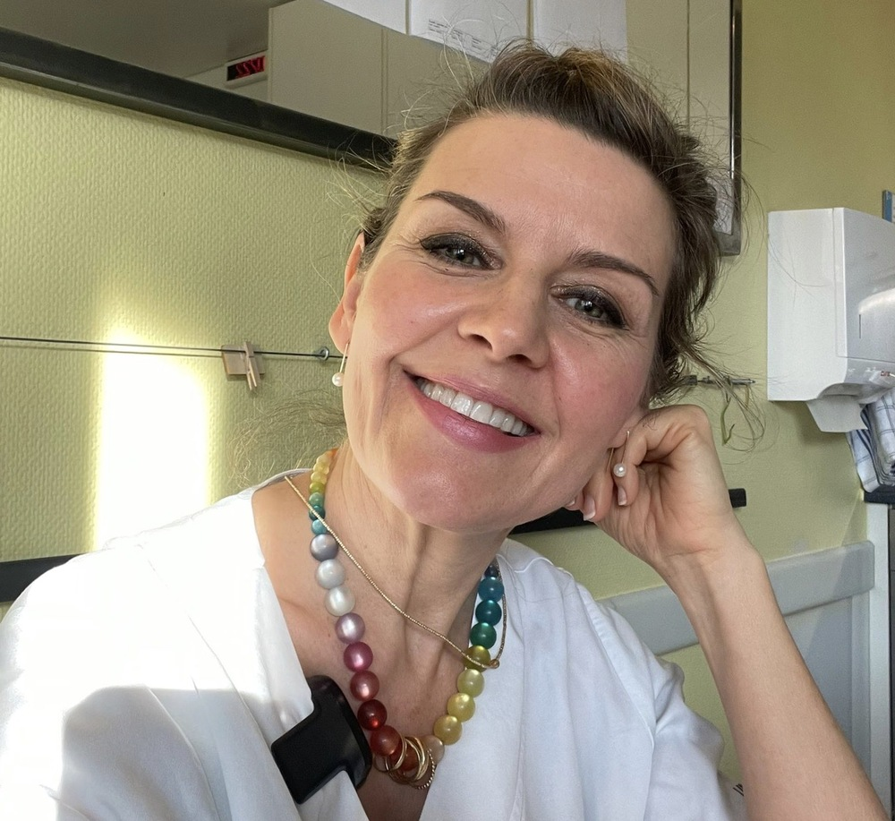
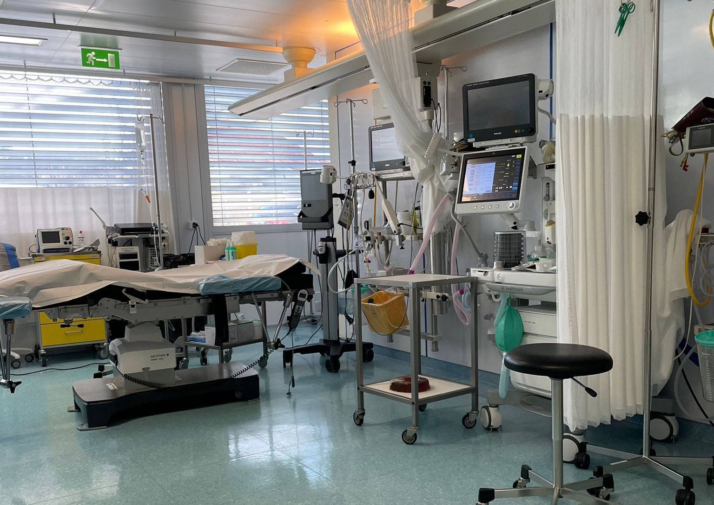

+++
title = "Stress ohne Ende, das Pflegepersonal steht am Rande seiner Kräfte"
date = "2023-05-07"
draft = false
pinned = false
tags = ["Deutsch", "Reportage"]
image = "whatsapp-image-2023-03-01-at-17.54.37-2-.jpeg"
description = ""
footnotes = "Abbildung 3: Arzt in der Coronazeit (https://www.pexels.com/photo/man-people-woman-technology-9574557/ )"
+++
 **Viele Spitäler kämpfen mit einem ernst zu nehmenden Problem: dem Pflegepersonalmangel. Viel zu viele Fachkräfte steigen aus und nur wenige interessieren sich für einen Beruf in der Pflege.**

*Eine Reportage von Kyra Meitinger und Ocean Steiner.*

Es ist 15 Uhr in einem kleinen Wartezimmer. Es riecht nach Desinfektionsmittel und nach dem Plastik steriler Handschuhe. Es handelt sich definitiv um ein Spital. Das Licht ist grell, die Wände und die meisten Möbel sind weiss. Alles wirkt sehr elegant und professionell doch gleichzeitig auch kalt und unpersönlich. Mehrere Minuten sind vergangen und noch immer keine Spur der Pflegefachkraft. Warten ist eine typische Situation im Spital. Nach etwa 10 Minuten erklärt die freundliche Person am Empfang, dass die Interviewpartnerin bald kommen würde. Momentan hat sie noch mit einem Notfall zu kämpfen. Es herrscht gerade grosser Stress, Spitalfachkräfte rauschen durch die Gänge und die Hektik ist förmlich spürbar. 20 Minuten nach dem vereinbarten Termin trifft eine freundlich lächelnde Frau im blauen Kittel in den Warteraum. Es ist die Interviewpartnerin Beatrice D., Pflegefachkraft auf der IMC. Auf dem Weg zum Pausenraum erklärt sie, wie alles hier im Sonnenhofspital funktioniert.

Auf einem kleinen Rundgang erfährt man viel über das Spital und sieht auch schon einige Patienten und Patientinnen, welche betreut werden. Dabei erklärt Beatrice ihre Arbeit.



 Beatrice D. 

 

Beatrice D. ist 49 Jahre alt und eine sehr zufriedene Person. Aufgewachsen ist sie in Bern, wo sie auch ihre Ausbildungen abschloss. Beatrice wohnt zusammen mit ihrem Ehemann und ihren zwei Töchtern im Kanton Freiburg. Ihre beiden Töchter sind schon im Teenageralter. Beatrice machte eine Ausbildung als Gesundheits- und Krankenpflegerin. Danach bildete sie sich zur Pflegefachfrau in der Intensivmedizin weiter. Momentan arbeitet sie im Sonnenhofspital, Lindenhofspital und Engeriedspital. Im Lindenhofspital arbeitet sie auf der Intensivstation, im Sonnenhofspital auf der Chirurgie gemischt mit Orthopädie (IMC) und im Engeriedspital auf der Notfallstation, IMC und Palliativstation. IMC steht für Intermediate Care. Auf der IMC werden Patienten und Patientinnen versorgt, die zwar keine intensive Behandlung brauchen, aber intensiv pflegerisch betreut und überwacht werden müssen. Die IMC ist eine Zwischenstufe zwischen Intensiv- und Normalstation. Beatrice D. liebt ihre Arbeit, insbesondere gefällt ihr das Team, in dem sie schon seit längerer Zeit arbeitet. Sie hat mittlerweile 30 Jahre Berufserfahrung, in welchen sie schon viel erlebt und gesehen hat. 



Momentan seien die meisten Betten besetzt, erzählt Beatrice. Dies bringt das Pflegepersonal natürlich ins Schwitzen, sagt sie. Aber weshalb sind dann nicht mehr medizinische Fachkräfte im Einsatz? 

> «Es war klar, dass wir im Jahr 2000 einen Pflegefachkräftemangel haben würden.»

### **Der Mangel an Pflegepersonal**

Der Pflegepersonalmangel ist ein grosses und sehr reales Problem, das hat man bei dem Besuch im Sonnenhofspital und durch die Interviews sofort festgestellt. Bereits seit Jahren fallen immer mehr Leute aus. Beatrice D. sagt: «Schon als ich mit der Ausbildung begonnen habe, war es klar, dass wir im Jahr 2000 einen Pflegefachkräftemangel haben würden.» Den Notstand bestätigt auch Catherine H., Ärztin im Lindenhofspital. Viele erfahrene Pflegefachkräfte steigen altershalber aus dem Beruf aus oder weil die Belastung einfach zu gross ist. Dies hat zur Folge, dass die jungen, noch unerfahrenen Pflegenden, niemanden zur Seite haben, der ihnen mit ihrem Erfahrungswissen beisteht. Das merke man auch als Ärztin oder Arzt, sagt Catherine H. Man müsse die Rolle der langjährigen Pflegenden übernehmen und den Jungen das praktische Anwendungswissen beibringen, welches nicht in der Ausbildung gelehrt, sondern nur durch die Erfahrung im Spital erworben werden kann. 

Eine neue Veränderung, speziell für die langjährigen Pflegenden, ist, dass man sehr viel mehr administrative Arbeiten zu erledigen hat, was eine grosse zusätzliche Arbeitsbelastung mit sich bringt. Das hat auch zur Folge, dass man weniger Zeit mit den Patientinnen und Patienten am Bett verbringen kann. Dies ist besonders für die langjährigen Pflegenden eine grosse Umstellung. Jedoch haben die neuen Pflegenden auch weniger die Möglichkeit, patientennahe Erfahrungen zu sammeln. Diese Situation gefällt vielen Pflegefachkräften nicht, da sie diesen Beruf gewählt haben, weil sie Menschen betreuen wollen.

>  «Die Pflegekrise hat schon viel früher begonnen und Covid hat halt die grossen Probleme sichtbar gemacht.»

### **Die Covid-19 Jahre und ihre Folgen**

Die Covid-19 Jahre haben die Situation zusätzlich verschärft, die Pflege ist an den Rand ihrer Kräfte gekommen. Dies bekam die Öffentlichkeit auch ganz deutlich mit, so dass der Pflegenotstand zum ersten Mal ins öffentliche Bewusstsein drang. Die Bürger und Bürgerinnen dankten den Schweizer Pflegenden mit Applaus, einer gut gemeinten, aber nichts bewirkenden Geste. Dies geben die Pflegefachkräfte auch deutlich zu verstehen: Es braucht mehr als Applaus.

Zur selben Zeit setzte die Landesregierung die im Gesetz festgehaltenen Limiten der Arbeits- und Ruhezeiten der Pflegefachkräfte aufgrund des Corona-Notstands aus. Eine politisch verständliche Massnahme, die für die Pflegenden zu unhaltbaren Stresssituationen führte: Die Covid-19 Massnahmen umzusetzen, um sich selbst nicht anzustecken, lebensbedrohlich kranke und hoch ansteckende Menschen zu versorgen und gleichzeitig noch Angehörige zu betreuen, welche aufgrund des Kontaktverbotes kein Besuchsrecht hatten, brachte das medizinische Personal an den Rand der Erschöpfung. Die Coronamassnahmen zur Beschränkung sozialer Interaktionen führten dazu, dass psychische Belastungen sowohl vom privaten als auch vom beruflichen Umfeld weniger abgefedert werden konnten. Dadurch erkrankten viele Pflegefachkräfte oder stiegen endgültig aus dem Beruf aus, da die Belastung nun definitiv zu hoch war. Im Gespräch erwähnt Anna M., Gewerkschaftssekretärin der Unia, dass die Pflegekrise schon viel früher als mit Corona begonnen habe und Covid nur die grossen Probleme in den Vordergrund rückte.

Seit einem Jahr gelten die Covidmassnahmen in der Schweiz nicht mehr. Die Missstände und die Unzufriedenheit des Personals kann man vor Ort jedoch immer noch klar erkennen. Neben dem Wunsch nach verbesserten Arbeitsbedingungen und mehr Lohn ist in den Gesprächen auch deutlich geworden, dass vielen die Teamarbeit sehr am Herzen liegt und ein kompetentes Team sowie eine gute Atmosphäre viel zur Zufriedenheit beitragen und sehr wichtig sind für ein gutes Arbeitsklima. Während des Interviews macht Beatrice eine Geste zu einer vorbeigehenden Mitarbeiterin. Es ist ein Herz, was zeigt, dass sie ihre Mitarbeiter und Mitarbeiterinnen sehr mag und eine freundschaftliche Beziehung zu ihnen hat.

### **Ein Schimmer der Hoffnung: Die Pflegeiniative**

Die Situation in den Spitälern während Corona hat der Schweizer Bevölkerung die Augen über den Pflegenotstand geöffnet, so dass die Pflegeiniative mit einem deutlichen Ja angenommen wurde. Dank der Pflegeinitiative ist man auf die Unverzichtbarkeit der Pflegefachkräfte in den Spitälern aufmerksam geworden.



 Die Pflegeiniative: «Für eine starke Pflege» 

 

Am 28 November 2021 wurde die Pflegeiniative von der Schweizerbevölkerung mit einem Ja-Anteil von 61 % angenommen. Die Umsetzung erfolgt in zwei Etappen:

**Erste Etappe:**

In der ersten Etappe geht es um die Finanzierung der Ausbildung. Die Kantone sollen einen Teil der Kosten der praktischen Pflegeausbildung übernehmen. Kantonale Beiträge für angehende Pflegefachpersonen an einer höheren Fachschule sollen deren Lebensunterhalt sichern. Der Bund unterstützt die Kantone dabei finanziell. Die Finanzhilfe läuft über acht Jahre und beträgt bis zu einer Milliarde Franken. Dazu sollen acht Millionen Franken in Projekte investiert werden, welche die medizinische Grundversorgung effizienter machen. Sollte kein Referendum ergriffen werden, kann mit der Inkraftsetzung um Mitte 2024 gerechnet werden. 

**Zweite Etappe:**

In der zweiten Etappe sollen die Arbeitsbedingungen, die Möglichkeiten der beruflichen Weiterentwicklung und die Entlohnung in der Pflege verbessert werden. Dabei soll auch die Qualität und die Verfügbarkeit der Pflegeleistungen gewährleistet werden. 



Beatrice D. sagt, dass man auch in der Lindenhofgruppe achtsamer geworden sei. Sie dürfe beispielsweise wünschen, ob sie lieber Tag-, Spät-, oder Nachtdienst arbeiten wolle. Es gebe auch ein Essen, welches den Nachtdienstarbeitenden gratis zur Verfügung gestellt werde. 

«Die Pflegeinitiative befasst sich aktuell vor allem mit der Ausbildung der Pflegenden. Das heisst, dass mehr Geld in die Ausbildung der Pflegenden investiert werden soll, damit mehr Personen ausgebildet werden», sagt Anna M. Der Hauptgrund, warum viele Pflegende aus ihrem Beruf aussteigen, sind jedoch die Arbeitsbedingungen. Ein Problem, welches Beatrice D. selbst erlebt hat, ist die Kinderbetreuung. Die Schichten im Spital beginnen bereits um 7 Uhr früh. Viele Kindertagesstätten öffnen allerdings erst dann und der Schulunterricht beginnt erst um 8 Uhr. Da gäbe es noch Verbesserungspotenzial. 

### **Welche Verbesserungen wünscht sich die betroffene Arbeitsgruppe selbst?** 

Was von den Interviewpartnerinnen immer als Verbesserungswünsche angebracht wird, sind ganz klar geregeltere Arbeitszeiten, eine bessere Entlohnung und familiengerechtere Strukturen. Ein noch eher neuer Vorschlag ist, einen eigenen Kompetenzbereich zu haben. Die Pflegefachkräfte sollen dabei in den pflegerischen Bereich fallende Entscheidungen ohne Einbezug von Ärzten und Ärztinnen treffen können. Dies würde automatisch zu weniger Arbeitsaufwand aller Seiten führen. Dadurch bekämen die Pflegefachkräfte auch die gebührende Wertschätzung für ihre Kompetenzen. 

Gewisse Wünsche der betroffenen Arbeitsgruppe haben bereits Gehör gefunden. Momentan wird zum Beispiel die Ausbildung attraktiver gemacht, um das Interesse am Beruf zu vergrössern. Dies soll dazu führen, dass mehr neue Personen in den Beruf einsteigen und der Mangel an Fachkräften minimiert werden kann. Ein nächster wichtiger Schritt wird sein, die Arbeitsbedingungen und die Entlohnung zu verbessern. Dies gehört auch zu den Umsetzungsschritten der Pflegeinitiative. Zur Freude der Pflegenden ist da etwas in Bewegung. Ein eigener Kompetenzbereich hingegen ist ein neuer und spannender Ansatz, welcher der Pflege mehr Entscheidungsfreiräume geben und viele Abläufe vereinfachen würde. 

Durch die Gespräche wurden viele verschiedene Eindrücke mitgenommen. Positive so wie negative. In Anbetracht der Problematik des Pflegepersonalmangels bleibt noch viel zu tun, das ist klar. Das Thema ist auch unter den Fachkräften sehr aktuell, das haben die Gespräche mit den Interviewpartnerinnen eindeutig gezeigt. Was durch die Begegnung mit Pflegefachkräften, Ärzten und Ärztinnen deutlich wird, ist, dass es durchaus positive Lösungsansätze gibt. Die Pflegefachkräfte setzen sich für eine bessere Pflege ein und lassen sich nicht entmutigen. Sie bestätigen alle, dass sie ihren Job trotz den mit dem Beruf kommenden Problemen nach wie vor gerne ausüben. Wie Brigitte B. aus dem Inselspital zum Schluss noch sagt: «Ich finde immer noch, dass Krankenpflege ein wirklich toller Beruf ist.» Sie würde ihren Beruf jederzeit wieder wählen. Aus den Gesprächen geht aber auch klar hervor, dass in Anbetracht der Problematik des Pflegepersonalmangels noch viel zu tun bleibt. Die Politik zeigt sich allerdings langsam bereit für Veränderungen, was alle in der Pflege Arbeitenden erfreut beobachten. Es bleibt zu hoffen, dass diese Ansätze auch in Zukunft fortgesetzt und ausgebaut werden. Denn die Pflegefachkräfte sind ein unverzichtbarer Teil unserer Gesellschaft, und eine qualitativ hochwertige Pflege ist essenziell für unser Gesundheitssystem.